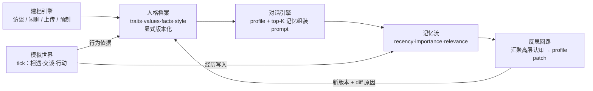

# 复制人 Replicant


**和你的复制人聊聊——它不是在扮演你，而是从你们聊过的话里长出来的你。**

市面上的「克隆你」产品停在一次性微调快照，「模拟社会」里的人设全是手写剧本。
这个项目把两端拼起来：**从真实对话生长出来的人格，放进一个会自由生活的迷你社会，而且永远不设封顶地继续长。**

---

## ✨ 核心亮点

- ✅ **访谈式人格建档** —— 5 阶段确定性状态机（自我介绍→人生故事→价值观→日常习惯→语言风格），
  LLM 只负责出题和抽取，收敛判据在代码里。斯坦福 [1052 人研究][p1052]背书：两小时访谈构建的
  个体 agent，能复现本人两周后重测的 ~85% 一致性。
- ✅ **三因子加权记忆流** —— 借鉴 [Generative Agents][smallville]：
  `score = 0.3·recency + 0.4·importance + 0.3·relevance`，importance 由 LLM 打 1–10 分。
- ✅ **显式版本化的无限演进** —— 聊天/上传/社会经历只写记忆；记忆攒到阈值触发反思（reflection），
  反思才可申请 profile patch，每版带 `diff_reason` 与来源标注，v1→v2→v3 永无封顶、全程可审计。
- ✅ **三种建档方式** —— 结构化访谈 / 即时闲聊（随时定型、定型后接着聊）/ 粘贴聊天记录秒建；
  外加仓库自带 3 个预制人物开箱可聊，档案可导出成 JSON 分享、朋友一键导入。
- ✅ **多复制人模拟社会** —— 每个 tick：行动规划 → 相遇配对 → 双人对话 → 记忆回写 → 偶发反思，
  全量事件入时间线。
- ✅ **真流式对话** —— SSE 逐字输出 + thinking 模型的「思考过程」可折叠查看，不做假进度条。

## 🗣 效果展示

真实 Kimi K3 调试中的一段对话（克隆「阿磊」的人格从访谈中建出，爱晨跑爱钓鱼）：

> 我：最近心情不太好怎么办
>
> 阿磊的复制人：嗯，先别硬扛，天塌不下来。我要是闷得慌就去江边跑两圈，出点汗脑子会清一点——你最近是事儿压着，还是单纯没劲？

先接住情绪、用档案里的真实习惯给建议、再反问回来——没有一句客服腔。更多完整记录见
[docs/debug-transcript.md](docs/debug-transcript.md)（含访谈、秒建、模拟社会双克隆对话）。

## 🏗 架构

一句话讲核心算法，是个五段闭环：**建档引擎**产出人格档案 → **对话引擎**用档案 + 记忆流检索组装
prompt → 对话沉淀为**记忆** → 记忆攒够触发**反思回路**，反思产出的新版本又喂回档案 → 多个克隆进入
**模拟世界**按 tick 自由生活，产生的经历同样汇入记忆流。



| 模块 | 职责 |
|---|---|
| `replicant/interview/` `chatsession.py` `chatlog_parser.py` `upload.py` | 三种建档入口：状态机访谈、闲聊草稿定型、聊天记录解析 |
| `replicant/persona/profile.py` | 显式版本化档案（来源 + diff 原因 + 归一化去重） |
| `replicant/persona/memory.py` | 记忆流：三因子检索、importance 打分、反思与批量吸收 |
| `replicant/chat.py` | 克隆对话：profile + top-K 记忆 → prompt（同步/流式） |
| `replicant/simulation/` | 模拟世界 tick：行动规划、双克隆对话、记忆回写 |
| `replicant/presets.py` + `presets/` | 预制档案幂等加载、导出/导入共享 |
| `replicant/llm.py` `replicant/style.py` | LLM 抽象（OpenAI 兼容 + 确定性 MockLLM）；口语风格注入 |
| `replicant/api/` `web/` | REST + SSE 接口；无构建链的 vanilla JS 前端 |

## 🚀 快速开始

```bash
git clone git@github.com:kdtmac/replicant.git && cd replicant
python -m venv .venv && .venv/Scripts/python -m pip install -r requirements.txt  # Windows
# Linux/macOS: source .venv/bin/activate && pip install -r requirements.txt

# 配置真实模型（.env 已在 .gitignore 中）
cat > .env <<EOF
REPLICANT_LLM_BASE_URL=https://your-openai-compatible-endpoint/v1
REPLICANT_LLM_API_KEY=sk-……
REPLICANT_LLM_MODEL=m-20260824185732-n8z5w/kimi-k3
EOF

.venv/Scripts/python -m uvicorn replicant.asgi:app --port 8000
```

浏览器打开 <http://127.0.0.1:8000>。不配 LLM 也能跑：自动回退内置 **MockLLM**（确定性台词与打分），
全链路（含测试）不依赖网络。跑测试：`.venv/Scripts/python -m pytest -q`。

## 📡 API 速览

| 方法 & 路径 | 说明 |
|---|---|
| `POST /interviews` · `/interviews/{id}/reply` | 结构化访谈（确定性状态机推进） |
| `POST /chat-sessions` · `/chat-sessions/{id}/msg` · `/chat-sessions/{id}/finalize` | 即时聊天建档（随时定型，定型后继续迭代） |
| `GET /chat-sessions` · `/chat-sessions/{id}/messages` | 会话列表与原始历史（刷新恢复） |
| `POST /clones/upload` · `/clones/import` · `GET /clones/{id}/export` | 聊天记录秒建 / 档案导入导出 |
| `POST /clones/{id}/chat` | 与克隆聊天（profile + top-K 记忆） |
| `POST …/reply|msg|chat/stream` | 三个接口均有 SSE 流式变体（status→reasoning→delta→done） |
| `GET /clones` · `/clones/{id}/profile-history` · `/clones/{id}/timeline` · `/clones/{id}/messages` | 列表 / 版本史 / 演进时间线 / 聊天历史 |
| `POST /sim/tick` · `GET /sim/timeline` · `/sim/state` | 模拟世界驱动与事件流 |

另有调试入口 `POST /clones/quick` 直接建档。

## 🛠 技术选型

- **FastAPI + uvicorn**：异步、自动 OpenAPI 文档；SSE 流式开箱即用。
- **SQLModel + SQLite**：零外部服务、单文件落库，Pydantic 校验顺带解决。
- **vanilla JS 前端**：无构建链、无 node_modules，clone 下来就能改。
- **openai SDK**：OpenAI 兼容协议可接任何模型服务；MockLLM 保证离线可测试。
- **不引入**：向量数据库、ORM 迁移工具、前端框架——MVP 阶段它们都是负资产。

## 📚 文档导航

- [docs/conversation-style.md](docs/conversation-style.md) —— 「轻量生活化」对话风格规范（所有开口说话的 prompt 都遵守）
- [docs/debug-transcript.md](docs/debug-transcript.md) —— 真实 Kimi K3 全链路调试记录
- [docs/design-rationale.md](docs/design-rationale.md) —— 六个关键决策与弃选理由的心路历程

## 🗺 Roadmap

已完成：

- [x] 三种建档方式（结构化访谈 / 即时聊天 / 上传记录）
- [x] 显式版本化人格演进 + 演进时间线
- [x] 多复制人模拟社会（tick / 双人对话 / 反思回路）
- [x] SSE 流式对话 + thinking 过程展示
- [x] 聊天记录落库与会话恢复（「继续聊」）
- [x] 预制档案 / 导出导入共享

待办：

- [ ] embedding 检索（relevance 函数已留好热插点）
- [ ] 模拟世界的地点系统与日程规划
- [ ] 多用户与鉴权
- [ ] 档案差分展示（profile diff 视图）

## 🙏 研究依据与致谢

- [Generative Agents: Interactive Simulacra of Human Behavior][smallville]（Stanford，UIST'23）——记忆流 / 反思 / 规划三件套的来源
- [Generative Agent Simulations of 1,000 People][p1052]（arXiv:2411.10109）——访谈式个体建模的可行性背书
- [WeClone](https://github.com/xming521/WeClone) —— 中文社区对「克隆你」需求的最好验证

[smallville]: https://github.com/joonspk-research/generative_agents
[p1052]: https://arxiv.org/abs/2411.10109
